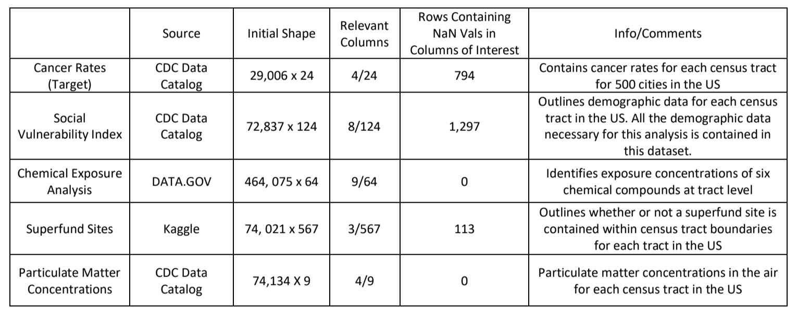
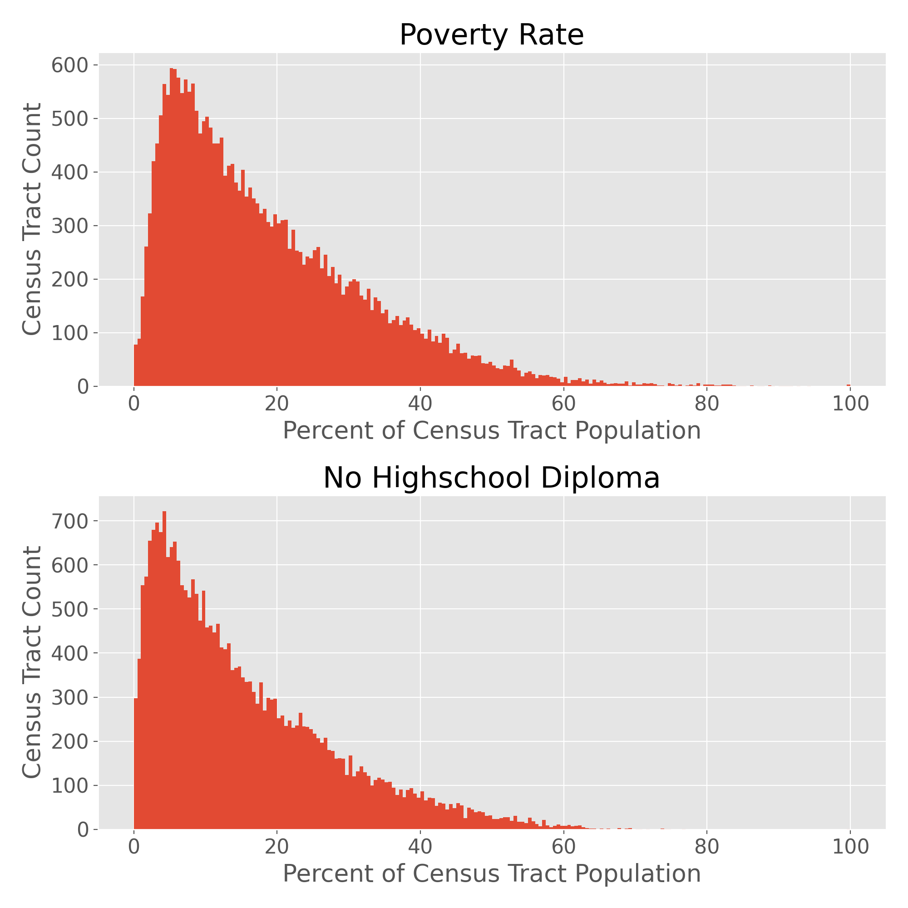

# What is Driving Cancer Rates at the US Census Tract Level?

   

###### Image shows CDC 500 Cities Project Cancer Rate Estimates ([Source](https://www.cdc.gov/500cities/index.htm))

------
Alex Truby

Galvanize Capstone 2

-----
## Project Goal

 The EPA has put together an "Environmental Justice Screening Tool" (EJST), which utilizes both environmental and demographic indicators in an effort to help policy makers identify communites' potential risk resulting from lack of enforcement around environmental laws, regulations, and policies. The screening tool does not, however, *actually* provide an "index" on which communities can be evaluated and ranked. 

While cancer rates are by no means the only indicators of community health and well being, that is what I have chosen as my target for this capstone. My hope is to use this analysis to better understand just one aspect of the many potential environmental justice aspects facing communities. 

#### My goal is to utilize similar features (both demographic and environmental) that the EPA uses as inputs into the EJST to better understand what most drives cancer rates in populations at the census tract level in the US.

To accomplish this goal, I've evaluted a few different inferential models to better understand what factors have the most influence on cancer rates. 

-----

## The Data

While the goal was to find data sets for all of the features that are utilized in the EJST, not all of them are publically available at the census tract level (many only get down to the county level). As a result, this model is a bit limited to proxy data sets that I was able to find for the census tract level. Additionally, cancer rates were only avaialble for 500 cities at the census tract level, so this study is limited to that scope.

The below table gives a snapshot of the data as it was initially collected. 

Each table had to be slightly modified in order to be able to combine them all into a single dataframe, broken out at the census tract level. The script for that data cleaning process can be found in the src folder of this repo.

----

## Inital EDA

A quick scatterplot of the model inputs illustrated that a few of the chemical hazard index columns (HIs) pulled in only contained zero values. Those features were dropped from the model. Additionally, it appeared that many of the demographic features included were likely correlated.

For example, the two histograms below of the raw data for both percent poverty rate and lack of high school diploma are extremely similar. This is a good indication that one of these features can likely be dropped.

Looking at the target by itself, there is a clear right skew to the data. There also appears to be a few cancer rate bins with many more census tract counts than what would fall in line with the general trend. This is another thing to keep in mind as the models are built out.

This first pass of EDA left seven features as inputs into the models: four environmental, and three demographic.

Further EDA, particularly for the linear regression model, will be covered later in the README.

-----

## Models Tested

As mentioned earlier, the goal of this project is to understand *what* is driving cancer rates in these census tracts, which limited the scope to looking at inferential regression models. The models of focus for this project are listed below - they were chosen because they are each able to provide insight around which of the input variables are most influencing cancer rates. 

### Linear Regression
Linear regression models arguably offer the best insight as to which variables are influencing the target by way of the model coefficients. However, in order for the coefficients to be interpretable, the model must meet the following five assumptions:

* Linearity (relationship between X and y)
* Independence
* No multicollinearity between features
    * One way to check for multicollinearity between input features is to check the variance inflation factor (VIF). A general rule of thumb is that if the VIF of a feature is greater than 10, is it likely collinear with another input for the model.
    * The following results were obtained after calculating the VIF for each of the seven input features:

    

    |Variable                | VIF     |
    | -------------          | ------- |
    |has_superfund           |  1.00   |
    |acetaldehyde_HI         | 14.65   |
    |diesel_HI               |  3.26   |
    |particulate_matter      | 19.71   |
    |percent_minority        | 9.22    |
    |percent_no_hs_diploma   | 4.73    |
    |percent_over_65_yrs     | 4.16    |

    * 
As can be seen above, there are a few features with a VIF above 10. Additionally, given the apparent collinearity of demographic features from a visual inspection during EDA, percent minority was also dropped since it was right on the cusp of the desired VIF threshold. Dropping both the particulate_matter and percent_minority variables, and running the VIF test again, all input variables had a VIF below ten.

|Variable                | VIF     |
| -------------          | ------- |
|has_superfund           |  1.00   |
|acetaldehyde_HI         |  6.91   |
|diesel_HI               |  3.22   |
|percent_no_hs_diploma   |  2.37   |
|percent_over_65_yrs     |  3.51   |

* Normally distributed residuals - This assumption was NOT met by the data. Further explanation and data exploration around where and why this failed can be found [here](https://github.com/alex-truby/galvanize_capstone_2/blob/master/linear_regression_README.md).
* Variance of the residuals is constant - This assumption also was NOT met by the data. The link above contains a detailed exploration of this assumption as well. 

Because not all of the assumptions for linear regression were met by the data, the coefficients from this model will not give accurate insight as to how the features are impacting the target. Given that obtaining this insight was the goal of this project, we will move on to a random forest model for analysis.

### Random Forest

While a random forest model does not provide near as much *reliable* interpretability as a linear regression, it can still provide some insight as to how the model is utilizing each of the input variables. The feature importances combine the following two metrics to give some insight as to how features are contributing to the model:
* The amount of information gained for splitting on a feature
* The portion of points that pass through a single split (more importance associated with splits made higher in the tree)

The following chart illustrates the importance of the input features into this model. These importances however **do not tell us the effect size and direction of the features**. That can only be gained from a linear regression model, which is why it is unfortunate those assumptions did not hold for this dataset. For example, we cannot conclude that a higher percentage of lack of highschool diploma in a census tract leads to increased cancer rates. Statements like that cannot be supported by this model, and can only be inferred based on domain knowledge (and assumptions still may not be correct).

It was interesting to find that a lack of highschool diploma was the most influential vairable for this model, followed (far behind) by diesel particulate matter. One thing to highlight is that the feature importances are not grouped by demographic and environmental inputs, rather a mix of them has shown to be important for the model.

While prediction wasn't the goal of this project, you'd hope that the model does decently well if you are trying to glean information around what is driving the target variable. Overall, the model was averaging within about a percentage point (where 1 = 1%). 

 Model RMSE = 0.9

-----

## Conclusion 

To re-emphasize, even though a linear regression model would give more insight as to how demographic and environmental factors are impacting cancer rates, it could not be utilized because not all of the model assumptions were met. Without having this insight however, we cannot say for sure what, if any, actionable measures can be taken to reduce cancer rates based on the features analyzed. 

That being said, this study has illustrated that both demographic and environmental factors are likely contributing factors to cancer rates at the census tract level. The model would probably still do fairly well utilizing only the demographic features based on the feature importances we just looked at, but is improved with the addition of the environmental features. Additionally, while these values illustrate that the lack of high school diploma was the most influential factor for this particular model, we do not have any clarity around what may be driving the education levels at the tract level. Do people with lower education/income end up driven into areas with lower environmental quality, and so end up with increased cancer rates? That would need to be answered with a separate study and might be something to look into for next steps.

___

## Next Steps

* Spend more time digging into the cancer rate outliers. Are there known reasons some cities have higher cancer rates? Is it a viable option to remove these points? 

* Potential to expand the study to other health related targets, such as asthma. Perhaps a linear regression model would be more telling with a different target.
