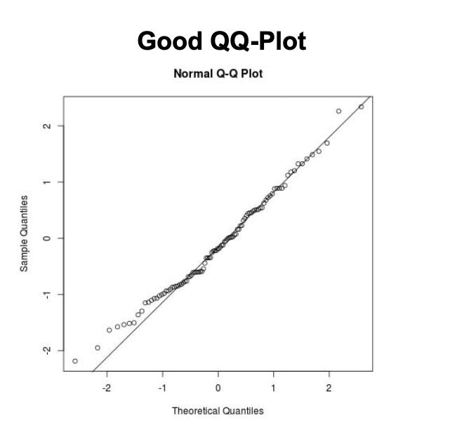
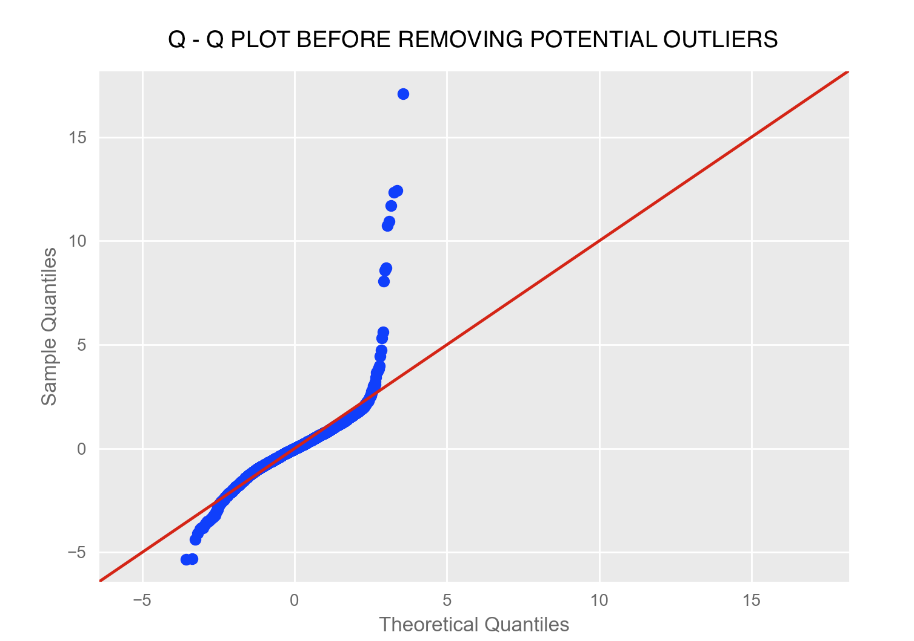
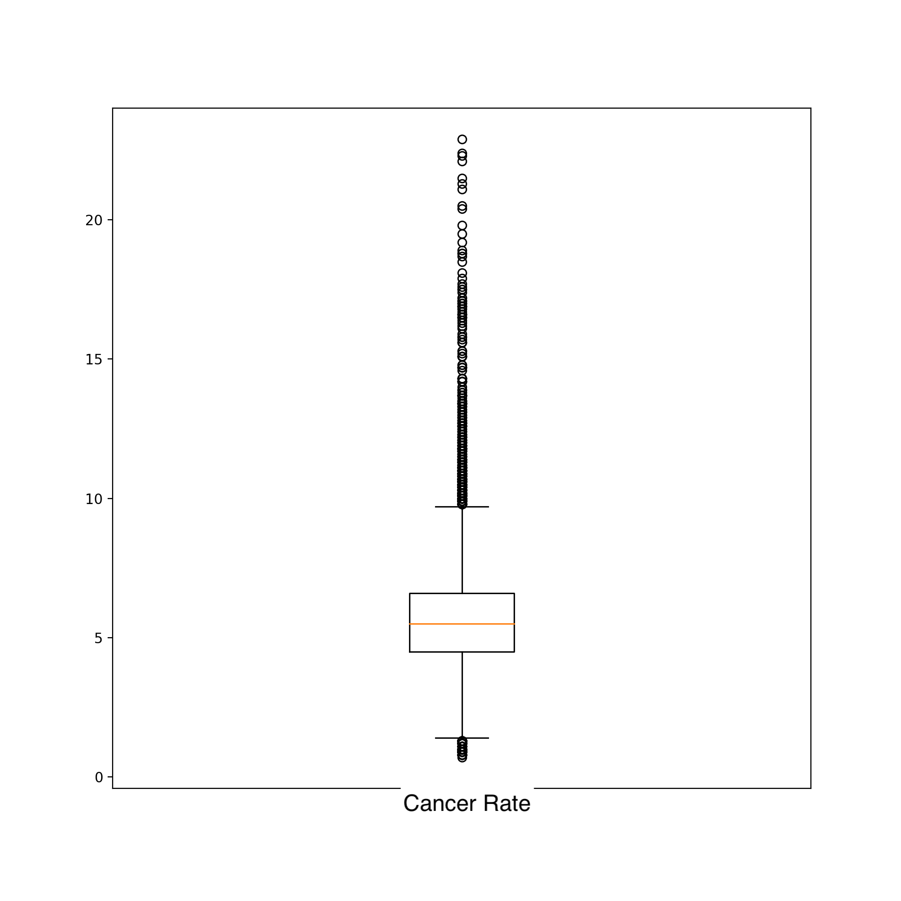

# Further Analysis on Linear Regression Model Assumptions

-----

As mentioned in the main README for this capstone project, the goal of this project was to utilize intferential models to gain insights as to *what* is contributing to cancer rates at the US census tract level, given both demographic and environmental factors as inputs. For this goal, a linear regression model should be the first choice, becuase the coefficients give clear interpretability as to how each feature is influencing the target. 

In order to ensure that the coefficients are reliable however, the following five assumptios must be met:

* Independence
* Linearity (relationship between X and y)
* No multicollinearity between features
* Normally distributed residuals
* Variance of the residuals is constant (homoscedasticity)

As covered in the main README, the first three assumptions are met with this data set. It began to breakdown however, after the residuals were output from the model. This document will dive into testing for both the distribution of residuals, as well as their variance, and will cover *why* a lienar regression was not chosen as the final model of focus for this project. 

-----

## Normally Distributed Residuals

A common way to check for normally distributed residuals is to create a QQ plot, which plots the divergence of the residuals from a normal distribution. If the residuals are normally distributed, the residuals should follow along a 45 degree line on the QQ plot (see example of a "good" QQ plot below).

After running an initial linear regression model after the collinear features had been removed with the VIF process, the follow QQ plot resulted:

While most of the data does follow along that 45 degree line, it strays significantly on either end of the data set. This is a good indicator that there are likely some outliers in the data. 

There are a few ways to check for outliers in the data. The first, and most straight foward, is to check for outliers in the target data set. The target in this case, is cancer rates at the census tract level. 

First, let's look at a boxplot of only the cancer rates to see if there are any immediate outliers.

