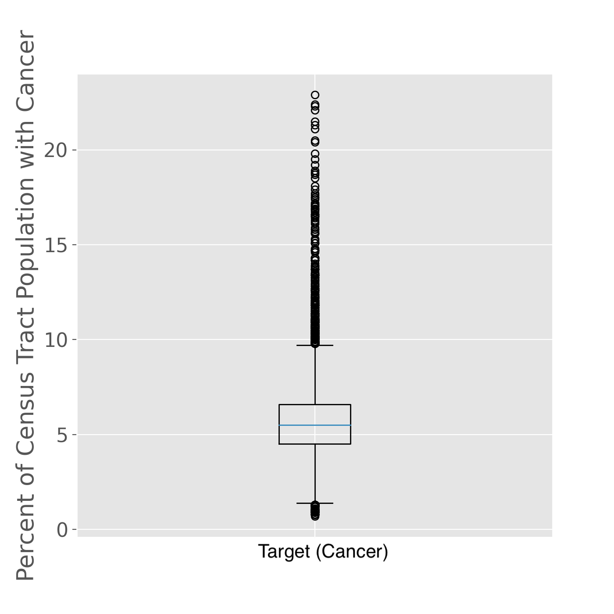

# Further Analysis on Linear Regression Model Assumptions

-----

As mentioned in the main README for this capstone project, the goal of this project was to utilize intferential models to gain insights as to *what* is contributing to cancer rates at the US census tract level, given both demographic and environmental factors as inputs. For this goal, a linear regression model should be the first choice, becuase the coefficients give clear interpretability as to how each feature is influencing the target. 

In order to ensure that the coefficients are reliable however, the following five assumptios must be met:

* Independence
* Linearity (relationship between X and y)
* No multicollinearity between features
* Normally distributed residuals
* Variance of the residuals is constant (homoscedasticity)

As covered in the main README, the first three assumptions are met with this data set. It began to breakdown however, after the residuals were output from the model. This document will dive into testing for both the distribution of residuals, as well as their variance, and will cover *why* a lienar regression was not chosen as the final model of focus for this project. 

-----

## Normally Distributed Residuals

A common way to check for normally distributed residuals is to create a QQ plot, which plots the divergence of the residuals from a normal distribution. If the residuals are normally distributed, the residuals should follow along a 45 degree line on the QQ plot (target line in red on the chart below).

After running an initial linear regression model after the collinear features had been removed with the VIF process, the follow QQ plot resulted:

While most of the data does follow along that 45 degree line, it strays significantly on either end of the data set. This is a good indicator that there are likely some outliers in the data. 

There are a few ways to check for outliers in the data. The first, and most straight foward, is to check for outliers in the target data set. The target in this case, is cancer rates at the census tract level. 

First, let's look at a boxplot of only the cancer rates to see if there are any immediate outliers.

As the box plot illustrates, there are many points that lie *way* out of the inner quartile range, which is skewing our data. Let's keep this in mind as we move on.

A second way to determine outliers in the data set is to calculate Cook's Distance for each of the variables input into the model. Cook's Distance communicates how much influence each data point for a feature has on the model calculation. Generally, unless there are outliers, the level of influence that each data point has should be relatively the same. You can visualize the level of influence of each data point in a feature with a Cook's Distance plot. An example of this plot is shown below for the superfund input into the model.  

These plots give a clear visualization if there are any outliers in each feature that are disproportionately impacting the target variable. Using the superfund example above, it is clear that two data points (out of 26,000+) for this feature were outliers. While two data points from one feature are not likely not have a large impact on the model, the outliers were still removed for good measure. This process was repeated for each of the five features input into the model, with only a few outliers found in 3/5 features. 

So, the few outliers contained in the input variables have been removed, and we know we have quite a few data points on the high side of our inner quartile range for our target variable. We do not know however, what is driving this skew in our data. There are no significant outliers in the general term of the word that look like bad data entry, etc. It could very well be that some areas just have higher cancer rates. While it is never good practice to artibtrarily remove data from the model, I wanted to varify that the assumption of normally distributed residuals was still violated if we removed all cancer rates above 15% (assuming that some other factor may be driving the cancer rates in these areas).

The QQ plot below illustrate that even *after* removing the *potential* cancer rate outliers, we still do not get a good fit. 

Given the multiple tests run, it can be concluded that the residuals from this model just do *not* fit a normal distribution, and **this assumption does not hold**.

-----

## Homoscedasticity

The assumption of constant variance in the residuals is important, because if it is not present, the model will not fit all parts of the model equally. This will lead to increased bias in the model.

Without removing any outliers from the data, the following residual variance plot resulted:

It can be gathered from a quick glance at the above plot that there is a fairly strong trend to the variane of the residuals. They are not equally distributed from the zero line on the y-axis, as it should be if the residuals had a constant  variance. 

Again, outliers should not be removed without strong evidence that there is a reason to do so. However, given the detailed anlaysis that was covered in the last section, we will jump to the residual variance plot that assumes outliers were removed.  If there is going to be constant variance in the model, it should be under these circumstances. 

While the variance of the residuals did tighten up, there is still a clear trend to the data. It is possible that there is at least one confounding variable missing form the model, but given the prevoius EDA performed and the failure of the last assumption, it is more likely that **this assumption also does not hold true**.

## Conclusion

Based on the above anlysis, the five assumptions necessary to have linear regression coefficients that are meanginful to interpret do NOT all hold true. Unfortuntalely, this means that we will have to rely on the less reliable feature importances of models such as random forest and gradient boost to gain insight as to which features most impact cancer rates at the census tract level.